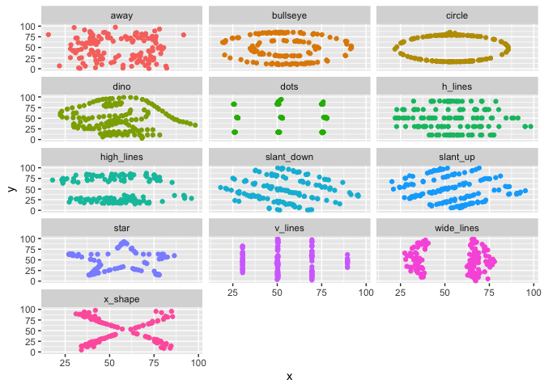

Lab 01 - Bonjour R
================
Xavier Lavoie
30 août 2024

## Chargement libraries et données

``` r
library(tidyverse)
library(datasauRus)
```

## Exercices

### Exercice 1

il dit qu’il a 1846 ligne et 3 variable mais je n’ai pas trouver le
nombre de colonne que le dataset possède il n’était pas inscrit.

datasaurus_dozen %\>% count(dataset) %\>% print(13)

### Exercice 2

Les réponses à cet exercice vous sont données ci-dessous. Mais vous
devriez nettoyer une partie du texte afin qu’il n’inclue que ce que vous
voulez rendre.

Commençons par tracer les données dans le jeu de données dino :

``` r
dino_data <- datasaurus_dozen %>%
  filter(dataset == "dino")

ggplot(data = dino_data, mapping = aes(x = x, y = y))+geom_point()
```

<!-- -->

Et calculez ensuite la corrélation entre `x` et `y` dans cet ensemble de
données :

``` r
dino_data %>%
  summarize(r = cor(x, y))
```

    ## # A tibble: 1 × 1
    ##         r
    ##     <dbl>
    ## 1 -0.0645

### Exercice 3

ensemble de donnée star

``` r
star_data <- datasaurus_dozen %>%
  filter(dataset == "star")

ggplot(data = star_data, mapping = aes(x = x, y = y))+geom_point()
```

<!-- -->

trouver le coeficient entre x et y

``` r
star_data %>%
  summarize(r = cor(x, y))
```

    ## # A tibble: 1 × 1
    ##         r
    ##     <dbl>
    ## 1 -0.0630

### Exercice 4

ensemble des données cercle

``` r
circle_data <- datasaurus_dozen %>%
  filter(dataset == "circle")

ggplot(data = circle_data, mapping = aes(x = x, y = y))+geom_point()
```

<!-- -->

coéficient entre x et y de l’ensemble de donnée cercle

``` r
circle_data %>%
  summarize(r = cor(x, y))
```

    ## # A tibble: 1 × 1
    ##         r
    ##     <dbl>
    ## 1 -0.0683

### Exercice 5

tracer tout les ensembles de données

``` r
ggplot(datasaurus_dozen, aes(x = x, y = y, color =
dataset))+
geom_point()+
facet_wrap(~ dataset, ncol = 3) +
theme(legend.position = "none")
```

<!-- -->

imprimer chaque corrélation entre chaque ensemble de données

``` r
datasaurus_dozen %>%
group_by(dataset) %>%
summarize(r = cor(x, y)) %>%
print(13)
```

    ## # A tibble:
    ## #   13 × 2
    ##    dataset   
    ##    <chr>     
    ##  1 away      
    ##  2 bullseye  
    ##  3 circle    
    ##  4 dino      
    ##  5 dots      
    ##  6 h_lines   
    ##  7 high_lines
    ##  8 slant_down
    ##  9 slant_up  
    ## 10 star      
    ## 11 v_lines   
    ## 12 wide_lines
    ## 13 x_shape   
    ## # ℹ 1 more
    ## #   variable:
    ## #   r <dbl>
